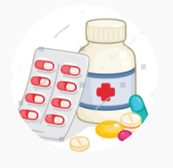

<!DOCTYPE html>
<html lang="en">
<head>
    <meta charset="UTF-8">
    <meta name="viewport" content="width=device-width, initial-scale=1.0">
    <title>Clinic On Call</title>
    <link rel="stylesheet" href="clinic on call.css">
    <link rel="stylesheet" href="https://cdnjs.cloudflare.com/ajax/libs/font-awesome/6.0.0-beta3/css/all.min.css">
</head>
<body>

    <header>
        <h1>Clinic On Call</h1>
        

            <a href="#home">HOME</a>
            <a href="#about">ABOUT</a>
            <a href="#services">SERVICES</a>
            <a href="#clinicsAndScheduleBooking">CLINICS & SCHEDULE BOOKING</a>
            <a href="#tm.1">TM.1</a>
            <a href="#tm.2">TM.2</a>
            <a href="#tm.3">TM.3</a>
            <a href="#contact-form">CONTACT</a>
            <a href=""><i class="fas fa-user-md"></i></a>
        

    </header>

    <section id="home">
        <h1>Meet doctors online</h1>
        <h2>Book appointment</h2>
    </section>
    <section id="about">
        

            <h1>ABOUT</h1>
            

            
Here we are doctors and patients contact with each other electronic, there are some features here like booking appointment at the clinic or remove it, know every clinics with their doctors,  
             services and location.

            
You can check all our clinics below.

            
We hope to make life as easier as we can.

        

        
    </section>
    <section id="services">
        <h1>-SERVICES-</h1>
        

            

                
                <h2>Contact with doctors</h2>
                
You can tell everything about your health condition to the doctor and he will diagnose your condition,
                     and you can ask him anything you want.

            

            

                
                <h2>Booking appointment</h2>
                
You can book an appointment according to what suits you and with any clinic and any doctor you want, and you will also be
                     given a notification to remind you of the appointment time.

            

            

                
                <h2>Description of medications</h2>
                
Prescribing appropriate medications for the patient according to his health condition
                     and helping him know where these medications are available

            

        

    </section>

</body>

</html>
